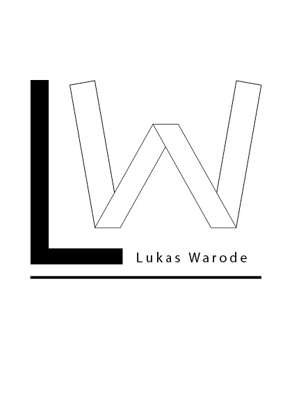

 
 

#### My name is Lukas Warode, I am a 21 years old political science student at the University of Bremen. I am especially interested in comparative politics and quantitative methods. Besides that I am working as a student assistant at SOCIUM - AG Manow, among others on the projects [*ParlGov*](http://www.parlgov.org) (Parliaments and governments database) and [*CinC*](http://parliamentarycareersincomparison.org) (Careers in Comparison). Besides my academic activity, I volunteer for *CorrelAid*, primarily at the local chapter Bremen.

#### I am very interested in statistical analysis and its applied concepts. Furthermore, aesthetical data visualization suits me in general. For these concerns I mainly use [R](https://www.r-project.org) and [RStudio](https://rstudio.com), particularly focusing on the ["tidyverse"](https://www.tidyverse.org).

#### Currently, I am in the final year of my Bachelor's degree. I also have spent one semester abroad studying at Queen's University Belfast.

